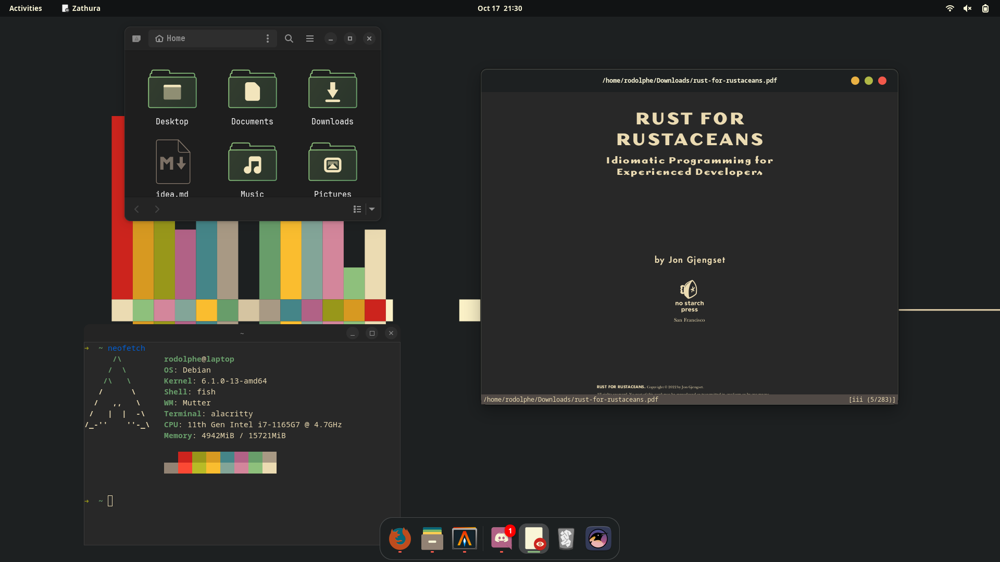
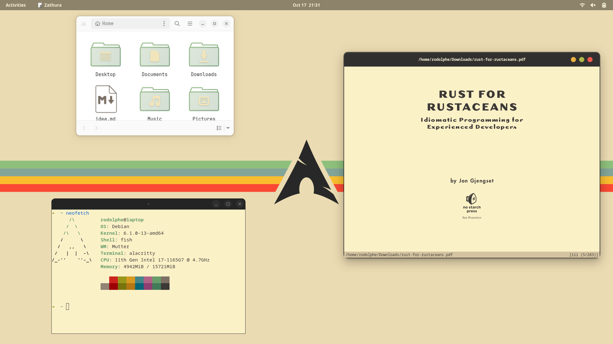

<<<<<<< HEAD
# dotfile

=======
# Configuration

- Operating System : Debian 12
- Window Manager : Gnome 43
- Terminal Emulator : Alacritty
- Text Editor : Helix
- Shell : Fish
- PDF Viewer : Zathura
- Theme :
  * Light : Gruvbox-light
  * Dark : Gruvbox-dark
- Cursor : Volantes_cursors
- Icons : Gruvbox
- Fonts : 
  * Jetbrains Mono
  * IBM plex mono
- Extensions : 
  * Blur my shell
  * Control Blur effect on lock screen
  * Dash to dock
  * Night theme switcher
  * User Themes
  * Wintile
  
## Screenshots

>>>>>>> gitea/master
